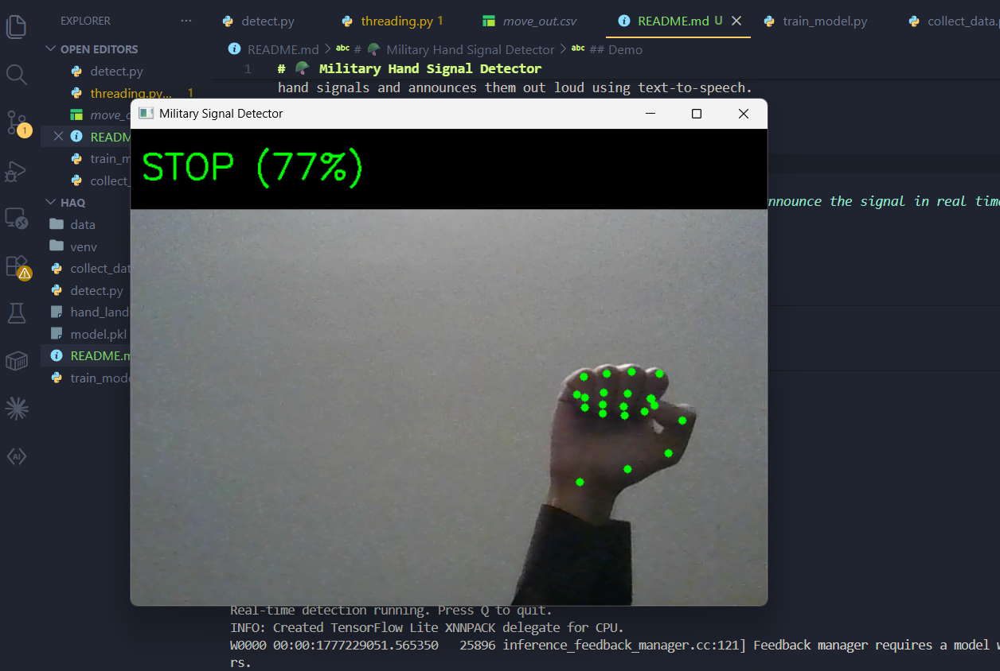

# 🪖 Military Hand Signal Detector

A real-time AI-powered military hand signal detection system using your webcam. Built with MediaPipe, OpenCV, and Scikit-learn. Detects tactical hand signals and announces them out loud using text-to-speech.

---

##  Demo

> Point your hand at the camera and the system will detect and announce the signal in real time.


---

##  Signals Supported

| Signal | Description |
|---|---|
| **Stop** | Flat hand raised, palm facing forward |
| **Move Out** | Index finger pointing forward, arm swinging |
| **Enemy** | Fist with index finger pointing downward |
| **Down** | Palm facing down, pushing toward ground |
| **Come Here** | Arm extended, fingers curling toward yourself |

---

##  How It Works

1. **MediaPipe** detects 21 hand landmark points (x, y, z) per hand from your webcam feed
2. Those landmark coordinates are fed into a **Random Forest classifier**
3. The classifier predicts which military signal is being shown
4. **pyttsx3** announces the detected signal out loud in real time

---

## Tech Stack

- [Python 3](https://www.python.org/)
- [OpenCV](https://opencv.org/) — webcam feed and visual overlay
- [MediaPipe](https://ai.google.dev/edge/mediapipe/solutions/guide) — hand landmark detection
- [Scikit-learn](https://scikit-learn.org/) — Random Forest classifier
- [pyttsx3](https://pypi.org/project/pyttsx3/) — text-to-speech output

---

##  Getting Started

### 1. Clone the repo
```bash
git clone https://github.com/zayd100/MILITARY-HAND-SIGNALS-CAMERA-DETECTOR.git
cd MILITARY-HAND-SIGNALS-CAMERA-DETECTOR
```

### 2. Create and activate a virtual environment
```bash
py -m venv venv
.\venv\Scripts\activate
```

### 3. Install dependencies
```bash
pip install opencv-python mediapipe scikit-learn numpy pyttsx3
```

### 4. Download the MediaPipe hand landmark model
```bash
curl -o hand_landmarker.task https://storage.googleapis.com/mediapipe-models/hand_landmarker/hand_landmarker/float16/1/hand_landmarker.task
```

---

##  Project Structure

```
MILITARY-HAND-SIGNALS-CAMERA-DETECTOR/
│
├── data/                  # CSV files of recorded hand landmarks
├── collect_data.py        # Record your own hand signal training data
├── train_model.py         # Train the AI classifier on your data
├── detect.py              # Run real-time detection with voice output
└── README.md
```

---

##  Usage

### Step 1 — Collect training data
```bash
py collect_data.py
```
- Pick a signal number
- Perform the signal in front of your webcam
- Press `SPACE` to capture 200 samples
- Repeat for all 5 signals

### Step 2 — Train the model
```bash
py train_model.py
```
Trains a Random Forest model on your captured data and saves it as `model.pkl`.

### Step 3 — Run real-time detection
```bash
py detect.py
```
Your webcam opens and the system detects and announces signals live.

---

##  Configuration

In `detect.py` you can adjust:

```python
COOLDOWN_SECONDS = 1.5  # how often it speaks when a signal is held
```

Lower this value for faster announcements.

---

##  Requirements

- Windows 10/11
- Python 3.10+
- Webcam
- `hand_landmarker.task` file (downloaded separately — see setup)

---

##  Future Ideas

- Add more signals (wedge formation, speed up, slow down)
- Full body pose detection using MediaPipe Pose
- Log detected signals with timestamps
- Build a GUI interface
- Add support for two-handed signals

---

##  Author

**Zayd** — [@zayd100](https://github.com/zayd100)

---

##  License

This project is open source and available under the [MIT License](LICENSE).